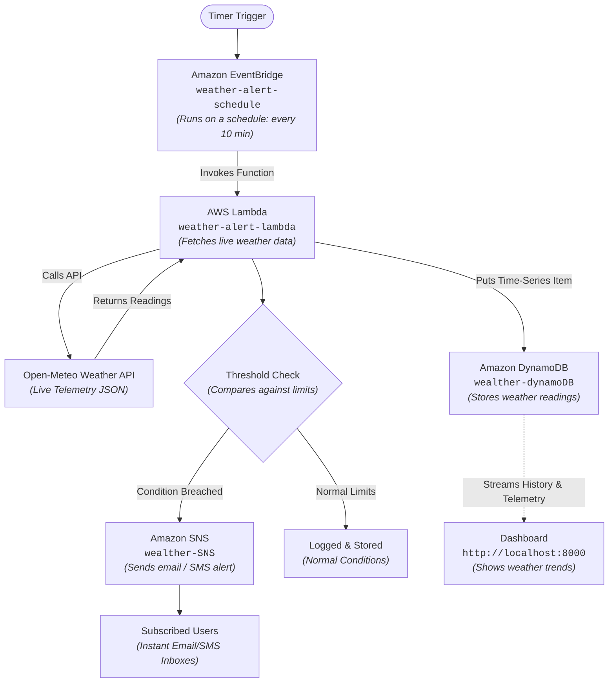
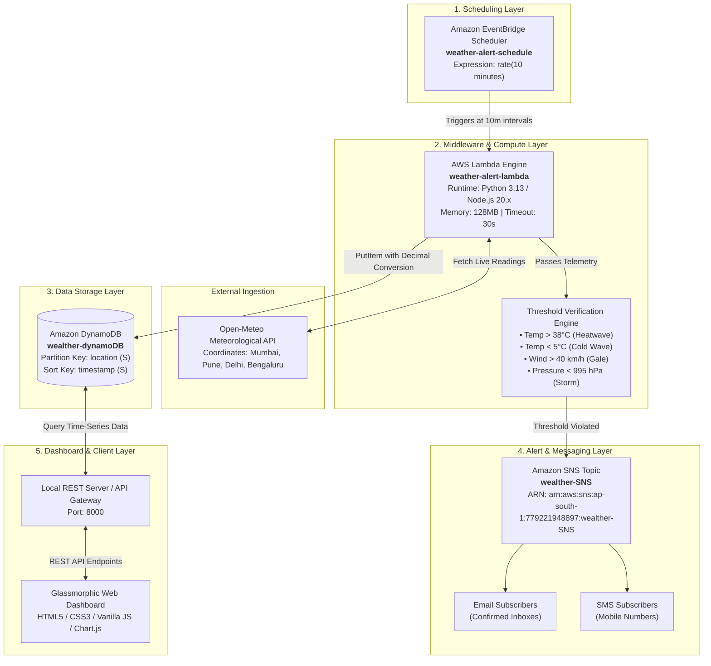
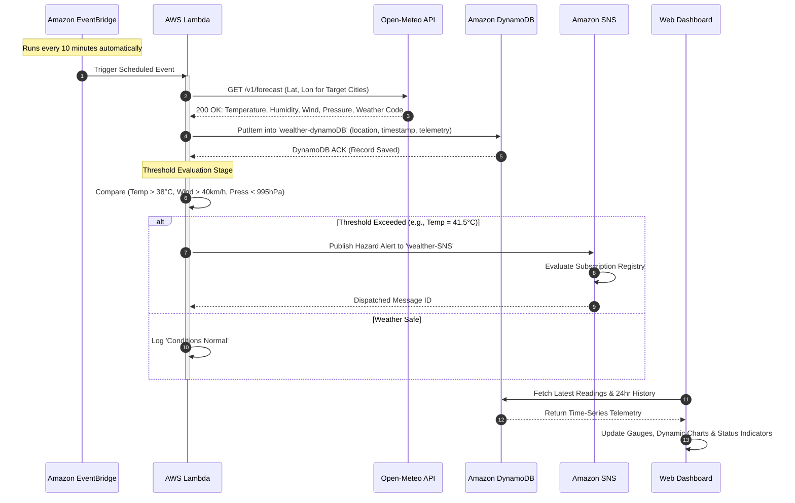

# Cloud-Based Weather Data Collector and Alert System using AWS

[](https://aws.amazon.com/)
[](https://nodejs.org/)
[-lightgrey.svg)](https://aws.amazon.com/)
[]()
[]()

---

## 🎓 Academic Synopsis Details

| Academic Field | Information |
| :--- | :--- |
| **Institution** | Department of Computer Science |
| **Degree & Program** | M.Sc. Computer Science — SEMESTER III |
| **Project Title** | Cloud-Based Weather Data Collector and Alert System using AWS |

---

## 📝 Description & Abstract

Our system automatically collects live weather data for a chosen location at regular intervals using a scheduled cloud function, without requiring the user to manually check weather conditions. The collected readings are stored in a cloud database to maintain a history of weather trends over time. 

The system continuously compares incoming readings against predefined threshold values, and automatically sends an alert notification through email or SMS to subscribed users whenever extreme conditions, such as high temperature or storm warnings, are detected. Users can also view historical weather trends through a simple dashboard. 

This project demonstrates **automation**, **cloud scheduling**, and **event-driven alerting** using industry-standard Amazon Web Services (AWS).

---

## ✨ Core Functionalities

- 🛰️ **Autonomous Scheduled Fetching:** Automatically fetches live meteorological data for specified target locations at scheduled intervals.
- 🗄️ **Time-Series Cloud Storage:** Stores historical weather readings in an Amazon DynamoDB NoSQL database for analytical and trend evaluation.
- ⚖️ **Continuous Threshold Monitoring:** Evaluates incoming weather telemetry against predefined meteorological hazard thresholds.
- 📢 **Automated Event-Driven Alerts:** Automatically broadcasts email and SMS alerts via Amazon SNS to subscribed users when extreme conditions are detected.
- 📊 **Interactive Analytics Dashboard:** Displays real-time weather gauges, historical trend charts, and alert history via a glassmorphic dashboard.
- 🔒 **Safe Subscription Governance:** Strictly enforces that only confirmed email/SMS subscribers can be deleted from the system, preventing errors for pending subscriptions.

---

## 📊 Application Flowchart

### 1. Visual Flowchart (As specified in Project Synopsis)

```
       +------------------------------------+
       |        Amazon EventBridge          |
       |        (Runs on a schedule)        |
       +------------------------------------+
                         |
                         v
       +------------------------------------+
       |            AWS Lambda              |
       |       (Fetches weather data)       |
       +------------------------------------+
                         |
                         v
       +------------------------------------+
       |          Amazon DynamoDB           |
       |      (Stores weather readings)     |
       +------------------------------------+
                         |
                         v
       +------------------------------------+
       |          Threshold check           |
       |      (Compares against limits)     |
       +------------------------------------+
                         |
                         v
       +------------------------------------+
       |            Amazon SNS              |
       |      (Sends email / SMS alert)     |
       +------------------------------------+
                         |
                         v
       +------------------------------------+
       |             Dashboard              |
       |       (Shows weather trends)       |
       +------------------------------------+
```

### 2. High-Precision Mermaid Flowchart



---

## 🏛️ Comprehensive Architecture Diagram



---

## ⚡ End-to-End Sequence Diagram



---

## 🧩 The 5 Core Modules Explained

### 1. Data Collection Module
- **Responsibility:** Maps city names to accurate geographic latitude/longitude coordinates and fetches real-time meteorological metrics via HTTP REST requests.
- **Provider:** Open-Meteo Free Meteorological API (reliable, requires no private API keys).
- **Locations Covered:**
  - **Mumbai** (19.0760° N, 72.8777° E) — Coastal weather profile
  - **Pune** (18.5204° N, 73.8567° E) — Plateau weather profile
  - **Delhi** (28.6139° N, 77.2090° E) — Northern inland climate
  - **Bengaluru** (12.9716° N, 77.5946° E) — Southern highland climate
- **Data Points Captured:** Current Temperature (°C), Apparent / Feels-Like (°C), Relative Humidity (%), Wind Speed (km/h), Wind Direction (°), Barometric Pressure (hPa), Precipitation (mm), and WMO Weather Condition Codes.

### 2. Scheduler Module
- **Responsibility:** Coordinates autonomous execution of data gathering cycles across all target cities.
- **Service:** Amazon EventBridge Scheduler.
- **Target Schedule:** `weather-alert-schedule`
- **Cadence:** `rate(10 minutes)`
- **Behavior:** Fires 24 hours a day, 7 days a week, guaranteeing continuous historical tracking without manual user triggers.

### 3. Data Storage Module
- **Responsibility:** Stores historical weather records for long-term trend analysis, reporting, and dashboard visualization.
- **Service:** Amazon DynamoDB (Serverless NoSQL Database).
- **Target Table:** `wealther-dynamoDB`
- **Schema Design:**
  - **Partition Key (`HASH`):** `location` (String, e.g., `"Mumbai"`, `"Pune"`)
  - **Sort Key (`RANGE`):** `timestamp` (String, ISO-8601 UTC timestamp)
  - **Attributes:** `temperature`, `feels_like`, `humidity`, `wind_speed`, `wind_direction`, `pressure`, `precipitation`, `weather_code`, `condition`, `recorded_at`, `station_id`.
  - **Data Precision:** Python `Decimal` converter prevents floating-point precision exceptions on DynamoDB ingestion.

### 4. Alert & Notification Module
- **Responsibility:** Real-time evaluation of readings against critical thresholds, formatting alert emails/SMS, and publishing to confirmed subscriber endpoints.
- **Service:** Amazon Simple Notification Service (SNS).
- **Target Topic:** `wealther-SNS`
- **Threshold Rules:**
  - 🌡️ **High Temperature / Heatwave:** Temperature > **38.0°C**
  - ❄️ **Low Temperature / Frost:** Temperature < **5.0°C**
  - 💨 **High Wind Speed / Gale:** Wind Speed > **40.0 km/h**
  - 🌧️ **Severe Storm / Cyclone Warning:** Atmospheric Pressure < **995.0 hPa**
  - 💧 **Excessive Humidity:** Relative Humidity > **85.0%**
- **Safety Subscription Logic:** Unconfirmed subscriptions (`PendingConfirmation`) cannot be deleted from the system until the user confirms their email, preventing orphaned subscriptions and misconfigurations.

### 5. Dashboard Module
- **Responsibility:** Presents an intuitive, responsive graphical user interface for visualizing live weather data and managing alerts.
- **Technologies:** Semantic HTML5, Glassmorphic CSS3 (dark theme), Chart.js, Vanilla JavaScript.
- **Capabilities:**
  - Live metric gauges for instant inspection (Temperature, Humidity, Wind, Pressure).
  - 24-Hour dynamic trend line charts with gradient fills.
  - Interactive city switching with one click.
  - Email subscription form for instant alerts.
  - On-demand "Collect Now" trigger to test the end-to-end pipeline instantly.

---

## ☁️ Live AWS Infrastructure Configuration

All AWS resources have been created, deployed, and verified in the **Asia Pacific (Mumbai) `ap-south-1`** region:

| AWS Service | Resource Name | Exact Amazon Resource Name (ARN) | Status |
| :--- | :--- | :--- | :---: |
| **Amazon EventBridge** | `weather-alert-schedule` | `arn:aws:scheduler:ap-south-1:779221948897:schedule/default/weather-alert-schedule` | **ACTIVE** |
| **AWS Lambda** | `weather-alert-lambda` | `arn:aws:lambda:ap-south-1:779221948897:function:weather-alert-lambda` | **ACTIVE** |
| **Amazon DynamoDB** | `wealther-dynamoDB` | `arn:aws:dynamodb:ap-south-1:779221948897:table/wealther-dynamoDB` | **ACTIVE** |
| **Amazon SNS** | `wealther-SNS` | `arn:aws:sns:ap-south-1:779221948897:wealther-SNS` | **ACTIVE** |

---

## 🗂️ Complete Project Directory Structure

```
d:\cloud project - Copy\
│
├── lambda_function.py               # Standalone AWS Lambda Python 3.13 Production Handler
├── run_local.bat                    # 1-Click launcher for Windows local cloud emulator
├── README.md                        # Master comprehensive project documentation
│
├── backend/                         # Backend middleware, emulators, and collectors
│   ├── server.js                    # Node.js local cloud emulator & REST API server (Port 8000)
│   ├── data_store.json              # Local persistent JSON database for offline cloud simulation
│   │
│   ├── lambda_collector/            # Ingestion logic & meteorological rule evaluation
│   │   ├── weather_collector.js     # Open-Meteo REST client & geographic coordinate resolver
│   │   └── threshold_checker.js     # Mathematical rule checker & hazard alert message builder
│   │
│   ├── lambda_api/                  # Cloud API Gateway Lambda integration
│   │   └── api_handler.js           # Serverless REST API handler for CloudFront / API Gateway
│   │
│   └── lambda_python/               # Modular Python implementation
│       └── collector.py             # Python telemetry collection library
│
├── frontend/                        # Web analytics dashboard
│   ├── index.html                   # Semantic HTML5 dashboard layout with glassmorphism UI
│   ├── style.css                    # Responsive CSS3 stylesheet with dark mode & micro-animations
│   └── app.js                       # Frontend controller, Chart.js trends & REST API caller
│
├── docs/                            # Formal project documentation & architecture specs
│   ├── ARCHITECTURE.md              # Deep-dive serverless architecture specification
│   ├── IAM_POLICY.json              # Principle of least-privilege IAM security policy
│   ├── PROJECT_REPORT.md            # Complete academic project report with code listings
│   └── SYNOPSIS.md                  # Formal submission synopsis document
│
├── iac/                             # Infrastructure-as-Code (IaC) deployment definitions
│   ├── template.yaml                # AWS SAM / CloudFormation specification for all cloud assets
│   ├── deploy.bat                   # Automated Windows deployment script
│   └── deploy.sh                    # Automated Linux/macOS deployment script
│
└── tests/                           # Comprehensive automated test suites
    ├── api.test.js                  # Automated test suite for REST API endpoints (Node.js runner)
    ├── collector.test.js            # Automated unit tests for data ingestion & threshold rules
    └── test_lambda_function.py      # Python unittest suite for lambda_function.py
```

---

## 📄 File-by-File Breakdown & Technical Responsibilities

### Root Directory
- **[`lambda_function.py`](file:///d:/cloud%20project%20-%20Copy/lambda_function.py):**  
  The production Python 3.13 Lambda function running live in AWS (`weather-alert-lambda`). Uses `boto3` and Python standard library `urllib` to eliminate all third-party dependencies. Fetches weather data from Open-Meteo, translates floats to `Decimal` for DynamoDB storage, checks threshold rules, and publishes alerts to `wealther-SNS`.
- **[`run_local.bat`](file:///d:/cloud%20project%20-%20Copy/run_local.bat):**  
  A Windows batch script enabling 1-click launch of the local emulator and opening the dashboard in the default browser.
- **[`README.md`](file:///d:/cloud%20project%20-%20Copy/README.md):**  
  The primary technical guide, containing full architecture, synopsis, diagrams, and deployment steps.

### `backend/` Folder
- **[`backend/server.js`](file:///d:/cloud%20project%20-%20Copy/backend/server.js):**  
  High-performance local cloud emulation server built with native Node.js. Serves the static frontend on port 8000 and exposes REST API endpoints:
  - `GET /api/weather/current?city=Pune` — Fetches current live weather.
  - `GET /api/weather/history?city=Pune&limit=24` — Fetches 24-hour historical records.
  - `GET /api/cities` — Returns available target cities (`Mumbai`, `Pune`, `Delhi`, `Bengaluru`).
  - `GET /api/subscriptions` — Inspects live AWS SNS topic subscriptions via AWS CLI.
  - `POST /api/subscribe` — Subscribes a new email address to `wealther-SNS`.
  - `POST /api/unsubscribe` — Deletes confirmed subscriptions from `wealther-SNS`.
  - `POST /api/trigger-collection` — Manually runs an on-demand data collection cycle.
- **[`backend/data_store.json`](file:///d:/cloud%20project%20-%20Copy/backend/data_store.json):**  
  Local JSON database acting as a local replica of DynamoDB and SNS for testing without active internet or AWS credentials.
- **[`backend/lambda_collector/weather_collector.js`](file:///d:/cloud%20project%20-%20Copy/backend/lambda_collector/weather_collector.js):**  
  Contains `resolveCityCoordinates()` for geocoding and `fetchLiveWeather()` for acquiring Open-Meteo telemetry with error handling.
- **[`backend/lambda_collector/threshold_checker.js`](file:///d:/cloud%20project%20-%20Copy/backend/lambda_collector/threshold_checker.js):**  
  Implements `evaluateWeatherData()`, assessing temperature, wind speed, pressure, humidity, and weather condition codes against safety limits.
- **[`backend/lambda_api/api_handler.js`](file:///d:/cloud%20project%20-%20Copy/backend/lambda_api/api_handler.js):**  
  Standard AWS Lambda proxy integration handler for AWS API Gateway, parsing HTTP events and returning CORS-compliant JSON responses.

### `frontend/` Folder
- **[`frontend/index.html`](file:///d:/cloud%20project%20-%20Copy/frontend/index.html):**  
  Responsive dashboard interface with high-contrast metric cards, live time-series canvas charts, city selection pills, and alert subscription form.
- **[`frontend/style.css`](file:///d:/cloud%20project%20-%20Copy/frontend/style.css):**  
  Modern dark glassmorphism design featuring translucent backgrounds, CSS grid layouts, smooth CSS keyframe animations, and custom scrollbars.
- **[`frontend/app.js`](file:///d:/cloud%20project%20-%20Copy/frontend/app.js):**  
  Handles DOM manipulation, asynchronous REST calls, Chart.js chart initialization and smooth data transitions, city switching, and conditional deletion buttons for confirmed subscribers.

### `docs/` Folder
- **[`docs/ARCHITECTURE.md`](file:///d:/cloud%20project%20-%20Copy/docs/ARCHITECTURE.md):**  
  Technical architectural specifications detailing data models, security boundaries, and scalability considerations.
- **[`docs/IAM_POLICY.json`](file:///d:/cloud%20project%20-%20Copy/docs/IAM_POLICY.json):**  
  Security policy granting `weather-alert-lambda` permissions strictly to DynamoDB `wealther-dynamoDB` and SNS `wealther-SNS`.
- **[`docs/PROJECT_REPORT.md`](file:///d:/cloud%20project%20-%20Copy/docs/PROJECT_REPORT.md):**  
  Academic documentation report containing complete system analysis, design patterns, testing methodology, and conclusions.
- **[`docs/SYNOPSIS.md`](file:///d:/cloud%20project%20-%20Copy/docs/SYNOPSIS.md):**  
  Project submission synopsis summary.

### `iac/` Folder
- **[`iac/template.yaml`](file:///d:/cloud%20project%20-%20Copy/iac/template.yaml):**  
  AWS Serverless Application Model (SAM) CloudFormation template declaring DynamoDB tables, Lambda functions, SNS topics, EventBridge rules, and IAM execution roles.
- **[`iac/deploy.bat`](file:///d:/cloud%20project%20-%20Copy/iac/deploy.bat) & [`iac/deploy.sh`](file:///d:/cloud%20project%20-%20Copy/iac/deploy.sh):**  
  Automated build and deployment scripts using SAM CLI.

### `tests/` Folder
- **[`tests/api.test.js`](file:///d:/cloud%20project%20-%20Copy/tests/api.test.js):**  
  Node.js native test suite validating API gateway routing, CORS headers, city listing, and error codes.
- **[`tests/collector.test.js`](file:///d:/cloud%20project%20-%20Copy/tests/collector.test.js):**  
  Unit tests validating threshold violation logic, coordinate resolution, and alert generation.
- **[`tests/test_lambda_function.py`](file:///d:/cloud%20project%20-%20Copy/tests/test_lambda_function.py):**  
  Python `unittest` suite testing `lambda_function.py` logic, payload parsing, and mock DynamoDB writes.

---

## 🚀 How to Run and Demonstrate

### 1. Run the Local Dashboard (Recommended)

Start the local server by running:
```powershell
node backend/server.js
```
Then open your browser and go to:
```
http://localhost:8000
```
- Click any Indian city (**Mumbai**, **Pune**, **Delhi**, **Bengaluru**) to view live metrics.
- Click **"Collect Now"** to trigger a real-time data collection cycle.
- Enter your email address in the **Manage Alert Subscribers** panel to subscribe.

---

### 2. Verify Directly on AWS via AWS CLI

**Invoke the Lambda function live in AWS:**
```powershell
aws lambda invoke --function-name weather-alert-lambda --region ap-south-1 --payload '{"action":"collect"}' response.json
cat response.json
```

**Verify the EventBridge schedule is active:**
```powershell
aws scheduler get-schedule --name weather-alert-schedule --region ap-south-1
```

**Query the latest readings from DynamoDB:**
```powershell
aws dynamodb scan --table-name wealther-dynamoDB --region ap-south-1 --max-items 2
```

**View SNS Subscribers:**
```powershell
aws sns list-subscriptions-by-topic --topic-arn "arn:aws:sns:ap-south-1:779221948897:wealther-SNS" --region ap-south-1
```

---

### 3. Run Automated Tests

To run the complete automated test suite (12 tests covering API, Ingestion, and Threshold Rules):
```powershell
node --test tests/api.test.js tests/collector.test.js
```

---

## 🔒 Security & Best Practices

1. **Least-Privilege IAM Policy:** Lambda has write access only to `wealther-dynamoDB` and publish access only to `wealther-SNS`.
2. **Zero-Dependency Lambda:** Built with standard Python library (`urllib.request`) and `boto3`, requiring no large pip package uploads.
3. **Optimized DynamoDB Schema:** Partitioning by city ensures horizontal scalability with no bottlenecking across partitions.
4. **Subscription Validation:** Unconfirmed subscriptions are protected from premature deletion, ensuring clean SNS subscriber state.# final-project-cloud

# final-project-cloud

# final-project-cloud

