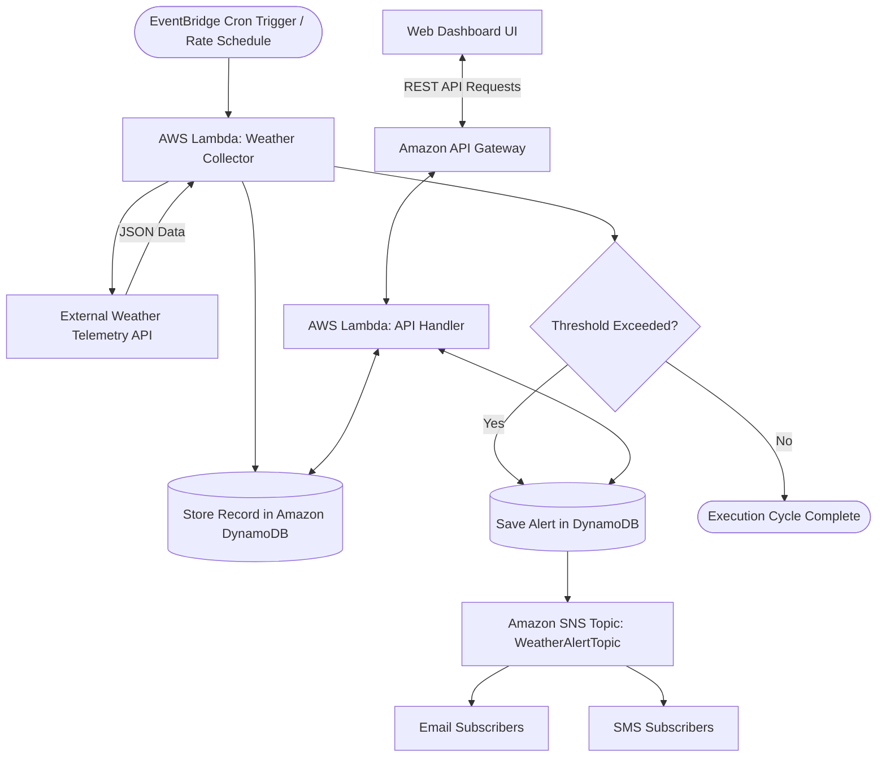

# Department of Computer Science
## M.Sc. Computer Science &mdash; Semester III
### Project Synopsis

---

### Project Metadata
- **Title of the Project:** Cloud-Based Weather Data Collector and Alert System using AWS
- **Students & Roll Numbers:**
  - **Abhishek Patil** &mdash; Roll No. **256237**
  - **Harshit Shelar** &mdash; Roll No. **256247**
- **Domain:** Cloud Computing, Distributed Systems, Event-Driven Architecture, IoT & Telemetry

---

### 1. Project Description
Our system automatically collects live weather data for chosen geographical locations at regular intervals using a scheduled cloud function, eliminating the need for manual user inquiry. The collected weather readings are systematically stored in a cloud database to maintain a rich historical time-series of weather trends over time. 

The system continuously compares incoming readings against predefined safety threshold values (such as extreme heat, gale-force winds, high humidity, barometric pressure drops, and severe storm warnings) and automatically sends an alert notification through email or SMS to subscribed users whenever hazardous conditions are detected. Users can also view historical weather trends, monitor real-time weather metrics, configure threshold limits, and simulate weather anomalies through a modern, responsive web dashboard. This project demonstrates automation, serverless computing, periodic scheduling, and event-driven alerting using industry-standard cloud services.

---

### 2. Key Functionalities
- **Automated Weather Ingestion:** Automatically fetches live meteorological data (temperature, apparent temperature, humidity, wind speed, wind direction, barometric pressure, precipitation, and WMO weather codes) for specified locations at scheduled intervals.
- **Historical Cloud Data Storage:** Persists historical weather readings in a scalable cloud NoSQL database for long-term analytical queries and trend tracking.
- **Continuous Threshold Monitoring:** Evaluates incoming weather metrics against configurable threshold limits in real time.
- **Event-Driven Automated Alerting:** Immediately dispatches formatted email and SMS alerts to subscribed recipients upon detecting threshold violations or severe weather events.
- **Interactive Weather Analytics Dashboard:** Visualizes temperature trends, humidity vs. wind speed dynamics, current weather status, active alerts feed, and threshold sliders through a modern web UI.

---

### 3. Application Flowchart

---

### 4. System Modules
1. **Data Collection Module:** Handles external API calls, dynamic geocoding for city coordinates, data sanitation, and metric parsing.
2. **Scheduler Module:** Managed cloud timer (Amazon EventBridge) triggering collection tasks automatically without dedicated server maintenance.
3. **Middleware & Compute Module:** Serverless compute functions (AWS Lambda) executing ingestion routines, threshold evaluations, and RESTful request dispatch.
4. **Data Storage Module:** High-performance, schema-flexible cloud NoSQL database (Amazon DynamoDB) storing time-series history, alert logs, and threshold configurations.
5. **Alert & Notification Module:** Pub/Sub cloud messaging topic (Amazon SNS) distributing critical weather alerts to multiple endpoints.
6. **Dashboard Module:** Modern frontend interface providing live telemetry cards, trend graphs, threshold customization, and cloud simulation controls.

---

### 5. Technologies Used
- **Frontend:** HTML, CSS and JavaScript (dashboard for weather trends, Chart.js visualizations, responsive glassmorphism design).
- **Scheduler:** Amazon EventBridge (triggers data collection at regular intervals via Cron/Rate rules).
- **Middleware (Compute):** AWS Lambda (JavaScript / Node.js 20.x with `@aws-sdk/client-dynamodb` and `@aws-sdk/client-sns` to fetch weather data and check thresholds).
- **Application Database:** Amazon DynamoDB (NoSQL cloud database to store historical weather readings and alert logs).
- **Notifications:** Amazon SNS (to send email/SMS alerts to subscribed users).
- **Infrastructure as Code (IaC):** AWS SAM & AWS CloudFormation (`template.yaml`).
